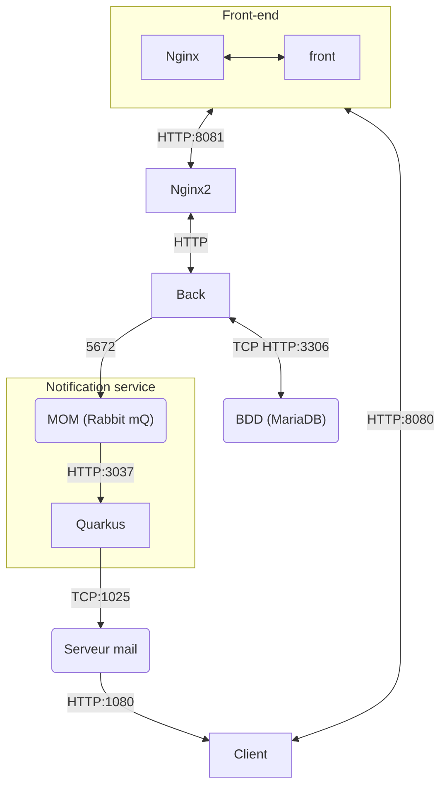

# Projet Architecture logiciel D'Axel MARTIN et Théo VINCENT
Projet fini

Ceci est le git de notre travail réalisé dans le cadre du module AL.

Vous pourrez retrouver notre compte rendu dans le fichier Rapport.pdf à la racine du projet

Pour démarrer le programme 
```bash
docker-compose up
```

l'architecture de notre projet :


La suite correspond au readme de projet de WM, néamoins il rest pertinant par rapport au back et au front

# Projet Web d'Axel MARTIN et Théo VINCENT

## Introduction
Notre projet se divise en deux parties distinctes : le front-end et le back-end. Bien qu'ils soient connectés, nous les démarrons de manière indépendante. Chacun d'eux est contenu dans un dossier spécifique, où "fr-administration" abrite le back-end et "fr-administration-front" contient le front-end.

## Back-end
Dans cette section, nous décrivons la structure complète du back-end de notre projet, y compris les contrôleurs, les services, les repositories et les entités. Elle expose également une multitude de points d'accès (endpoints) qui seront utilisés ultérieurement dans le front-end. De plus, une base de données stocke les informations nécessaires.

Pour le démarrer, placez-vous à l'intérieur du dossier "fr-administration" et exécutez la commande suivante :

```bash
npm run start
```

Cela lancera votre back-end.

Si cette commande ne fonctionne pas, il est probable que Node.js ne soit pas installé avec toutes les dépendances requises. Vous pouvez résoudre cela en exécutant la commande suivante :
```bash
npm install
```

## Front-end

Dans cette section, vous pourrez interagir avec le système. Le code complet se trouve dans le dossier "fr-administration-front". Réalisé avec Angular, il est découpé en composants.

Après avoir lancé le back-end, vous devez démarrer le front-end avec la commande suivante :

```bash
ng serve --open
```
Vous serez redirigé vers une page où vous pourrez vous connecter.

Utilisez les identifiants suivants (indiqués comme admin) :

* Identifiant : 1
* Mot de passe : 123

Vous accéderez ensuite à un profil (en l'occurrence le vôtre). Sur cette page, vous pourrez :

* Changer votre nom.
* Changer votre prénom.
* Changer votre mot de passe.

Vous verrez également une liste des associations auxquelles l'utilisateur est affilié.

En haut de la page, une barre de navigation offre les options suivantes :

* Un bouton de déconnexion.
* Un bouton de profil.
* Un bouton "Users List" pour afficher tous les utilisateurs.
* Un bouton "Association List" pour afficher toutes les associations.

#### Users list
Dans la section "Users List", vous pouvez ajouter un nouvel utilisateur en fournissant le nom, le prénom, l'âge et un mot de passe. Vous pouvez également supprimer un utilisateur à l'aide du bouton de corbeille.
Dans cette même section, il est possible d'accéder au information d'un utilisateur,il vous suffit de cliquer sur son id. Vous allez ainsi pouvoir voir ses informations et les modifier

#### Association List
Dans la section "Association List", vous trouverez la liste des associations et vous avez la possibilité d'en ajouter avec un nom.
Dans cette même section, il est possible d'accéder au information d'une association (informations sur l'association, ses membres et ses minutes) ,il vous suffit de cliquer sur son id. Vous allez ainsi pouvoir voir ses informations

## Résumé

Les fonctionnalités disponibles en front-end sont les suivantes :

* Accéder à son profil et mettre à jour ses informations (changement de nom et de mot de passe).
* Lister les utilisateurs.
* Lister les associations.
* Accéder à la fiche d'un utilisateur (informations personnelles et liste des associations dont il est membre).
* Accéder à la fiche d'une association (informations sur l'association, ses membres et ses minutes).
* Supprimer une association ou un utilisateur.
* Ajouter un utilisateur.
* Ajouter une association.

Ce qui reste à faire :

* Modifier une association (modification des rôles, par exemple).
* rechercher un utilisateur ou une association par son id

## SMQ

Axel (après la date de rendu de WM, sur le projet de WM) s'était amusé à faire un petit jeu de blind-test de musiques des groupes d'idols japonais de la Sakamichi Series (SMQ --> Sakamichi Music Quiz, technique), accessible depuis la barre de navigation.
Afin de pouvoir en profiter, il faut envoyer rentrer curl.exe -X POST http://localhost:8081/song/load dans un terminal, afin que la base de données se charge. Ensuite, le principe est simple, après avoir appuyé sur "Start" il faut deviner les titres des musiques (en caractères romains) qui passent et les rentrer dans le champ de réponse. À partir de 3 caractères entrés, 5 suggestions s'afficheront sous le champ de réponse si le titre existe dans la database (d'environ 500 musiques, taper par exemple "nak" affichera 5 noms contenant "nak" ), et il est possible de cliquer dessus ou de faire Tab + ENTREE.
La database contient 4 groupes, les boutons en haut à droite permettent de choisir quels groupes peuvent jouer (ne rien cliquer met tout par défaut).